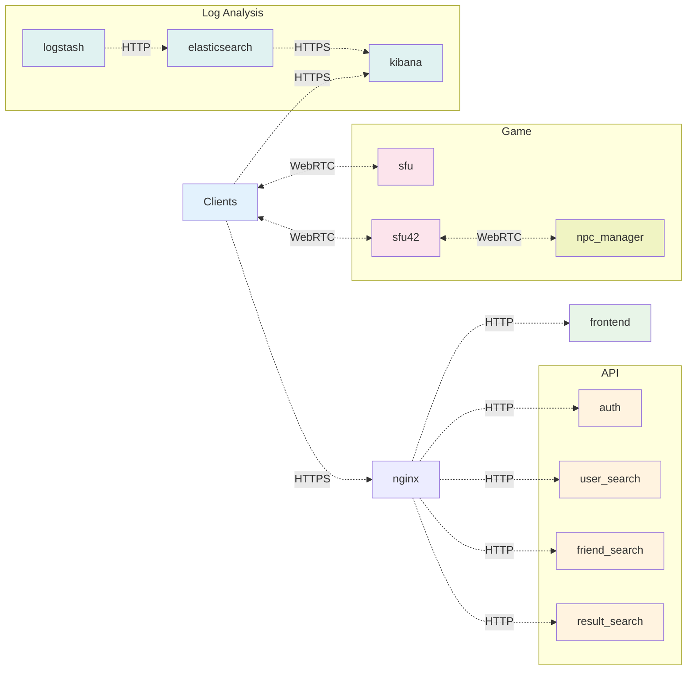

# ft_transcendence
**42-player online PONG using [WebRTC SFU](https://scrapbox.io/guide-to-the-galaxy/WebRTC_SFU)🏓**

---

# Description
https://github.com/user-attachments/assets/db8236c5-d69a-40e0-9dff-afa223103984
<div style="display: flex; gap: 10px; margin: 20px 0;">
  
  
  
  
</div>

ft_transcendence is a Project to build a web application in close collaboration with teammates under a two-month time constraint.  
For more information:
* [Project Wiki](https://deepwiki.com/smizuoch/ft_transcendence/1-overview)
* [Learning Hub](https://scrapbox.io/guide-to-the-galaxy/)

# Usage
### Requirements
- Docker Desktop
```shell
brew install --cask docker
```

### 1. Install
```shell
# Clone this repository
git clone https://github.com/tobeshota/ft_transcendence
# Change directory to this repository
cd ft_transcendence
# Create env file
cp ./secrets/.env.example ./secrets/.env
```

### 2. Configure `./secrets/.env`
| Variable | Description | Example |
| --- | --- | --- |
| HOST_IP | Your local machine's IP address | 192.168.1.100 |
| ANNOUNCED_IP | Your local machine's IP address | 192.168.1.100 |
| GOOGLE_CLIENT_ID | Google OAuth client ID | your-id.googleusercontent.com |
| GOOGLE_CLIENT_SECRET | Google OAuth client secret | your-secret |
| SMTP_HOST | Email server for 2FA | smtp.gmail.com |
| SMTP_USER | Email account for 2FA | your-email@gmail.com |
| SMTP_PASS | Email app password | your-app-password |

### 3. Launch Application
```shell
# Launch the Docker containers
make up
```

### 4. SSL Certificate Setup
Register the public key certificate `./secrets/certs/ca.crt` in your web browser.

# Technology Stack

<details>
<summary>View Technology Stack</summary>

## Core Technologies
| Technology | Purpose |
|------------|---------|
| [React](https://reactjs.org/) + [TypeScript](https://www.typescriptlang.org/) | Frontend Framework |
| [Tailwind CSS](https://tailwindcss.com/) | CSS Framework |
| [Node.js](https://nodejs.org/) + [NestJS](https://nestjs.com/) | Backend Runtime & Framework |
| [Fastify](https://fastify.dev/) | HTTP Server |
| [MediaSoup](https://mediasoup.org/) | WebRTC SFU for Real-time Communication |
| [Socket.IO](https://socket.io/) | WebSocket Communication |
| [Prisma](https://www.prisma.io/) + [SQLite](https://sqlite.org/) | Database & ORM |

## Infrastructure
| Technology | Purpose |
|------------|---------|
| [Docker](https://www.docker.com/) | Containerization |
| [nginx](https://nginx.org/) | Reverse Proxy |
| [webserv](https://github.com/tobeshota/webserv) | Serving with my own HTTP/1.1 server :D |
| [ELK Stack](https://www.elastic.co/) | Log Analysis |

</details>


# Development Process

| Task | Purpose | Definition of Done |
|------|---------|-------------------|
| [Preliminary Study](https://scrapbox.io/guide-to-the-galaxy/【4%2F23_-_5%2F02】ft_transcendence事前学習) | Understand web apps | Implement a simple web app |
| [Requirement Definition](https://scrapbox.io/guide-to-the-galaxy/【5%2F08_-_5%2F09】ft_transcendence要件定義) | Define project scope | Create a requirements document |
| [Design](https://scrapbox.io/guide-to-the-galaxy/【5%2F13_-_5%2F16】ft_transcendence設計) | Plan the architecture | Write a [Screen Design Document](https://scrapbox.io/guide-to-the-galaxy/ft_transcendence画面設計書) and a [DB Design Document](https://scrapbox.io/guide-to-the-galaxy/ft_transcendenceDB設計書) |
| [Implementation](https://docs.google.com/spreadsheets/d/1m0k-AYQ1fprnzzoou5p9SSvFhIgakw8mnbiXoMJMcwo/edit?gid=543851996#gid=543851996) | Build the project | Make all screens functional |

# System Architecture
A [microservices](https://scrapbox.io/guide-to-the-galaxy/microservices) architecture was chosen for independent development and deployment.


# After the Festival
_`ft_transcendence` is the final project of the Common Core at [42](https://42tokyo.jp/)._

_The two years I spent at 42 were two years of learning how to learn._
_It was a daily routine of mobilizing people, books, and AI to adapt to unknown rules and apply them to the problems at hand._

_And you know… [our spacewalk](https://scrapbox.io/guide-to-the-galaxy/) isn’t over just yet :D_
